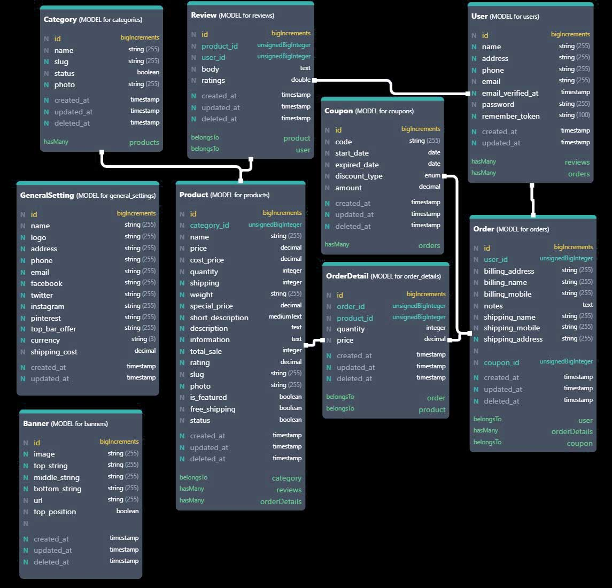

# Open Shop
[](https://github.com/kabirkhyrul/open-shop/issues) [](https://github.com/kabirkhyrul/open-shop/network) [](https://github.com/kabirkhyrul/open-shop/stargazers)  
> A basic e-commerce script  for Curious Laravel developer.

Be Advised: This E-Commerce is Developed for Laravel Learning. Not for commercial use. If you need commercial version, please contact with [me](mailto:dev.kabir01@gmail.com).


## Features
	- Role Management
	- Laravel Component Structure
	- Laravel Form Request
	- Laravel Policy 
	- Laravel Soft Delete
	- Laravel File Upload
	- Laravel Crud With Factory & Seeder
	- Laravel Storage
	- Session Management
	- Route Management
	- Test For Every Controller 
	- Translation Support 

and many more ...

## ERD



## Requirements

	PHP >= 7.2.5
	BCMath PHP Extension
	Ctype PHP Extension
	Fileinfo PHP extension
	JSON PHP Extension
	Mbstring PHP Extension
	OpenSSL PHP Extension
	PDO PHP Extension
	Tokenizer PHP Extension
	XML PHP Extension

## Install

Clone repo

```
git clone https://github.com/kabirkhyrul/ShopNow.git
```

## How to setting 

Go into .env file and change Database 
Run following code in cmd 

```

php artisan storage:link && php artisan migrate && php artisan db:seed
```


	
> for more fake data comment out `database\seeds\DatabaseSeeder.php`


## For Admin
	username: admin@admin.com
	password: 123456

## Supervisor & Mentor
<table style="text-align: center;">
	<tr>
		<td>
			<a href="https://github.com/roobon"></a>	
		</td>
		</tr>
	<tr>
		<td>
			<h3>Syed Ziaul Habib</h3>
			<strong>Trainer, IDB-BISEW IT Scholarship  Project</strong>
		</td>
	</tr>
</table>
	
	
	


  


